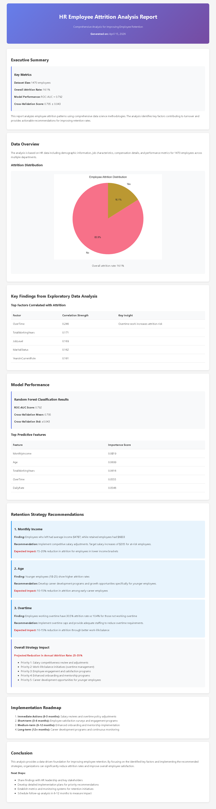

# HR Analytics — Attrition Analysis

Analyzes employee attrition patterns and predicts at-risk staff using Random
Forest classification.

## Key Findings
- Dataset: 1,470 employees, 16.1% overall attrition rate
- Random Forest model: ROC-AUC 0.792, cross-validation 0.795 ± 0.043
- Top predictive features: MonthlyIncome, Age, TotalWorkingYears, OverTime, DailyRate
- Employees working overtime churn at 30.5% vs 10.4% for those who don't
- Projected 25–35% reduction in annual attrition rate if recommendations are implemented

## What I Did
- Explored attrition distribution and correlation of key HR factors
- Trained a Random Forest classifier with cross-validation
- Ranked feature importance to identify the strongest attrition drivers
- Delivered retention strategy recommendations with a phased implementation roadmap

## Report Preview

## Tools
Python · scikit-learn · pandas · EDA · cross-validation
